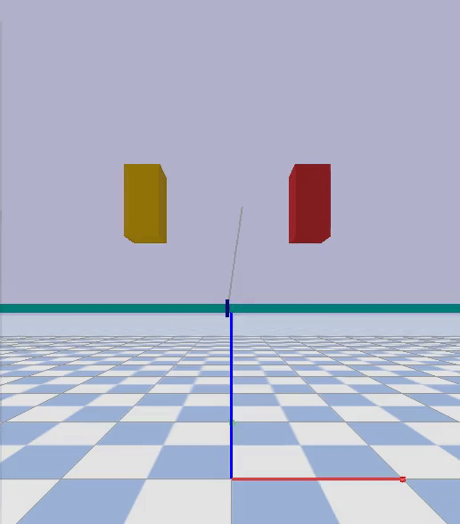
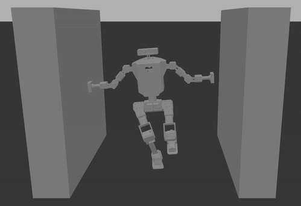
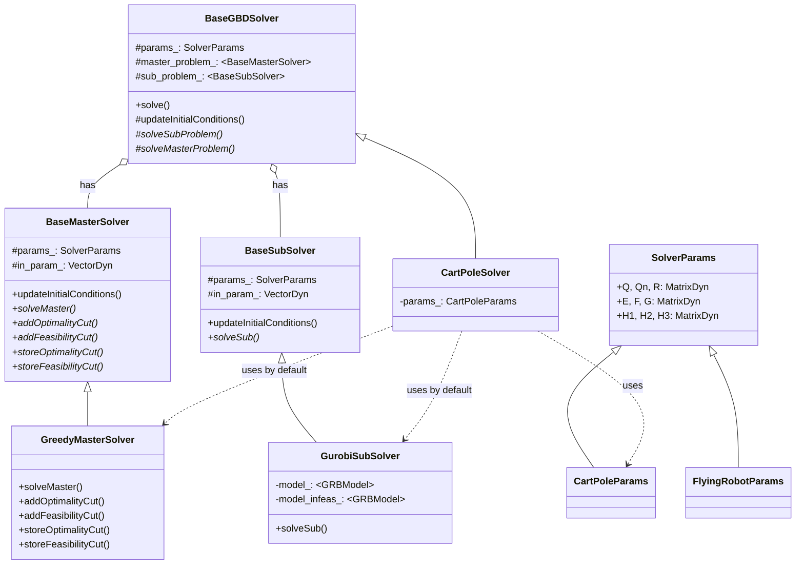

# Benders-MPC

Model Predictive Control implementation using Generalized Benders Decomposition (GBD), with applications to systems with contact dynamics.

## Overview
This project implements a model predictive control (MPC) framework using Generalized Benders Decomposition (GBD). The framework is particularly designed for handling systems with mixed-integer constraints, such as hybrid motion planning or contact dynamics. 

## Demonstrations

<div align="center">

| Cart Pole | Humanoid Balancing |
|:---------:|:------------------:|
|  |  |

</div>

# Associated paper
This repo is associated with my paper titled [Accelerate Hybrid Model Predictive Control using Generalized Benders Decomposition](https://arxiv.org/pdf/2406.00780).

## Key Features
- Generalized Benders Decomposition framework for MPC problems
- Example implementations:
  - Cart-pole system with wall contacts
  - Free-flying robot with obstacle avoidance
  - Motion planning through a dynamic maze
- Python bindings for simulation and visualization
- Integration with Gurobi optimizer

## Prerequisites
- CMake (3.10 or higher)
- C++ compiler with C++17 support
- Python 3.8 or later
- Gurobi Optimizer
- PyBullet (for simulation)

## Building
```bash
mkdir build && cd build
cmake ..
make
```

## Framework Architecture
The GBD framework is structured with the following key components:


